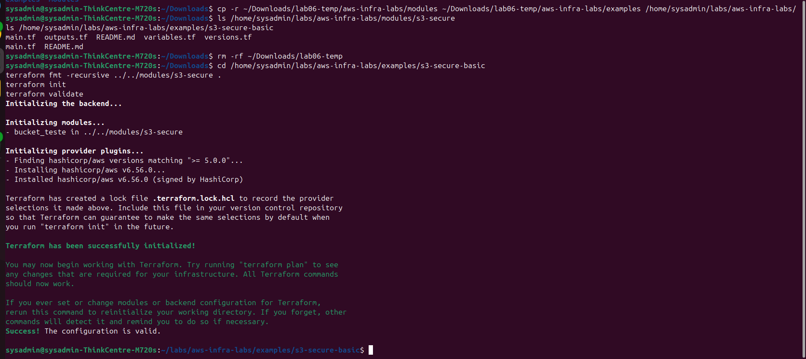
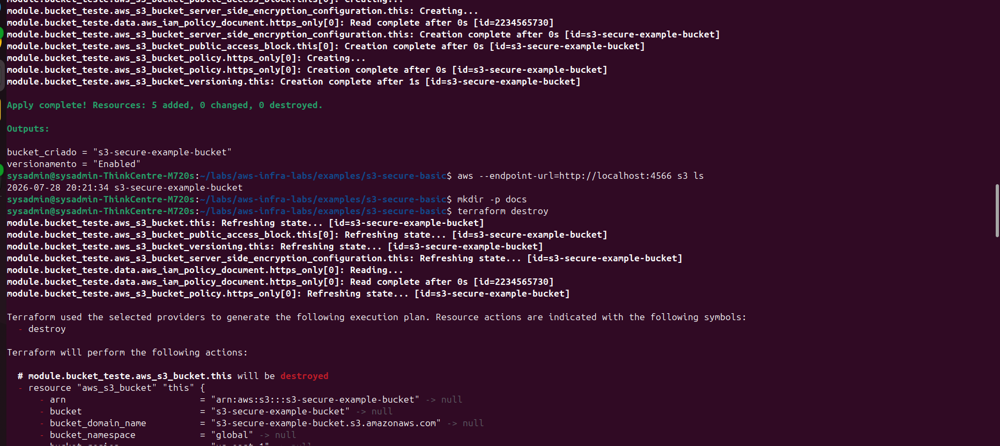
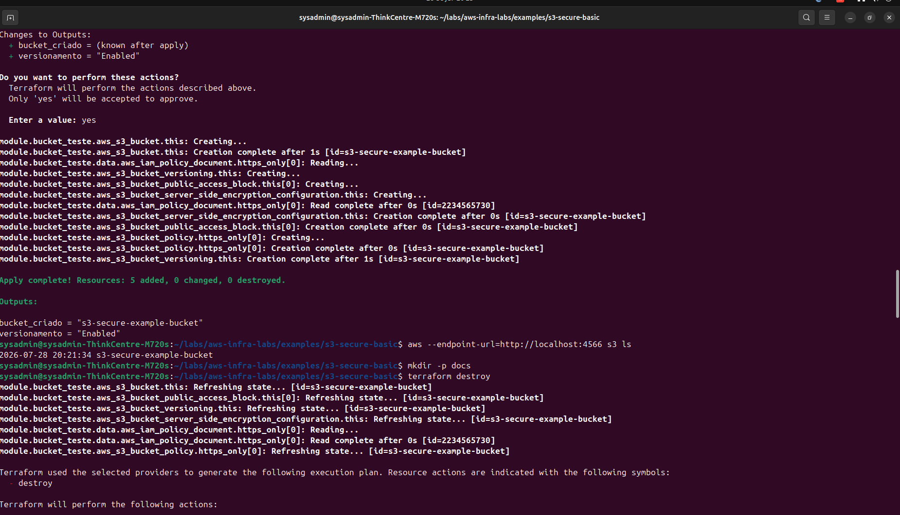
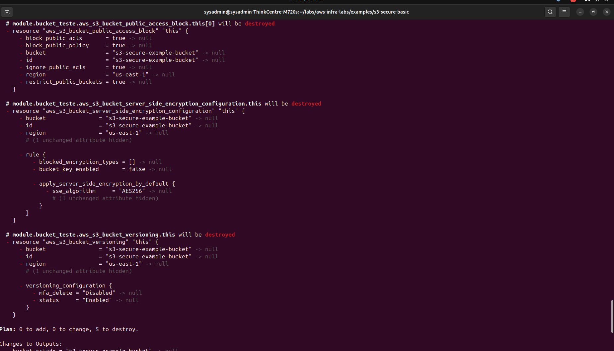
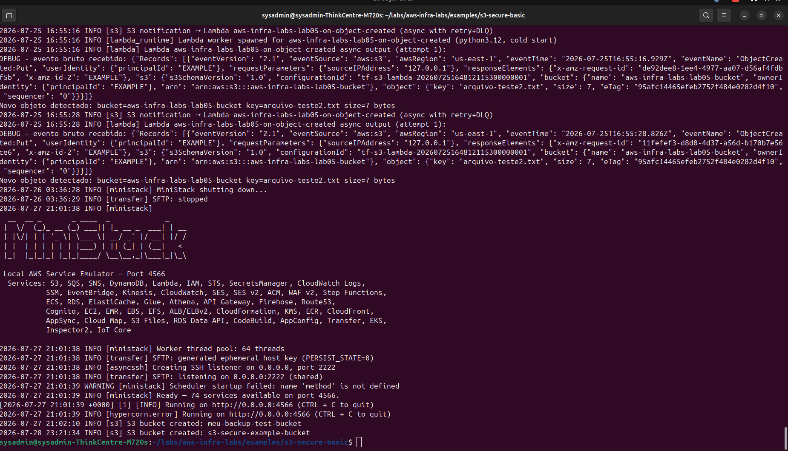
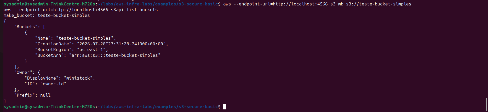
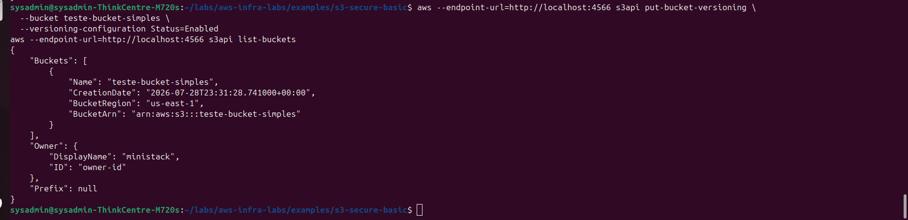
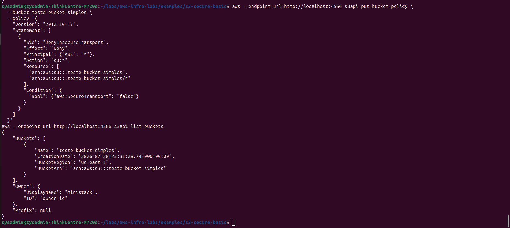

# Exemplo: s3-secure-basic

Exemplo mínimo de uso do módulo [`s3-secure`](../../modules/s3-secure), pronto para ser testado localmente via `ministack`.

## Como testar

1. Confirme que o `ministack` está rodando:
   ```bash
   docker ps -a | grep ministack
   docker start ministack   # caso esteja parado
   ```

2. Abra `main.tf` e descomente o bloco de override do provider (endpoints apontando para `http://localhost:4566`).

3. Inicialize e aplique:
   ```bash
   terraform init
   terraform apply
   ```

4. Confirme a criação do bucket:
   ```bash
   aws --endpoint-url=http://localhost:4566 s3 ls
   ```

   > Nota: se o AWS CLI reclamar de checksum (`CRC64NVME`), use:
   > ```bash
   > export AWS_REQUEST_CHECKSUM_CALCULATION=when_required
   > ```

5. Ao terminar, destrua os recursos de teste:
   ```bash
   terraform destroy
   ```

## Evidências

Testado com sucesso via `ministack`. Sequência completa da validação:

### Validação de sintaxe

`terraform fmt` + `terraform init` + `terraform validate` rodando sem erros:



### Apply e confirmação do bucket

`terraform apply` criando os 5 recursos do módulo (bucket, versionamento, criptografia, public access block, policy HTTPS-only), com o bucket confirmado logo depois via `aws s3 ls`:





### Destroy

Plano de destruição dos 5 recursos, executado ao final do teste para não deixar recursos órfãos no `ministack`:



### Nota técnica: investigação de comportamento intermitente

Durante a validação, um `terraform apply` bem-sucedido foi seguido, em um momento pontual, pelo desaparecimento do bucket no `ministack` sem nenhum log de exclusão — o `terraform destroy` reportou "nada a destruir". Para isolar a causa, cada recurso do módulo foi recriado manualmente via `aws s3api`, um de cada vez:









Todos os recursos, testados individualmente e de forma sequencial, sobreviveram normalmente — o que aponta para uma condição de corrida pontual do `ministack` ao processar as múltiplas chamadas paralelas que o provider `hashicorp/aws` dispara logo após criar o bucket, e não para um defeito no módulo. Detalhes completos da investigação estão documentados no [README do módulo](../../modules/s3-secure/README.md#comportamento-intermitente-observado-no-ministack).
