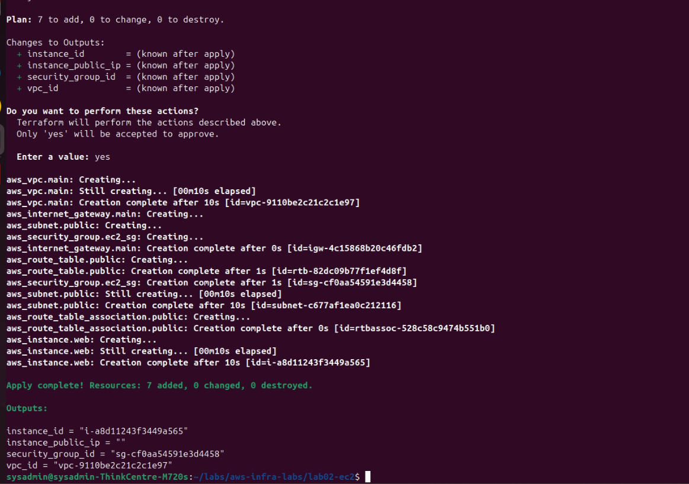

# Lab 02 — EC2 com Security Group restrito ao meu IP

## Objetivo

Subir uma instância EC2 em subnet pública, mas com acesso SSH liberado **apenas para o meu próprio IP** — não `0.0.0.0/0`, que é o erro de configuração mais comum (e mais explorado) em servidores expostos na internet.

## Por que isso importa

Um security group com `0.0.0.0/0` na porta 22 significa que **qualquer IP do planeta** pode tentar se autenticar na sua máquina. Isso é o primeiro alvo de bots que varrem a internet inteira 24h por dia procurando porta 22 aberta. Restringir ao seu IP reduz a superfície de ataque de "toda a internet" para "só eu".

## Arquitetura

```
Internet
   |
[Internet Gateway]
   |
[Subnet Pública 10.0.1.0/24]
   |
[EC2 Instance] <---- SSH (porta 22) liberado só para {seu IP}/32
```

## Este lab é self-contained

Diferente de depender do `lab01-vpc` estar aplicado, este lab cria sua própria VPC mínima — assim você pode rodar o lab02 sozinho, sem pré-requisito. Isso facilita testar e destruir cada lab de forma independente.

**Evolução futura**: em vez de duplicar a rede, o ideal em um projeto real é o lab02 consumir os outputs do lab01 via `terraform_remote_state` — isso demonstra composição entre módulos, que é como infraestrutura de verdade costuma ser organizada.

## Como rodar

1. Descubra seu IP público:

```bash
curl -s https://checkip.amazonaws.com
```

2. Rode o Terraform passando seu IP (lembre do `/32` no final, que restringe a um único IP):

```bash
terraform init
terraform plan -var="my_ip=SEU_IP_AQUI/32"
terraform apply -var="my_ip=SEU_IP_AQUI/32"
```

Ou, se preferir não digitar toda vez, crie um `terraform.tfvars` (não commitar, já está no `.gitignore`):

```hcl
my_ip = "SEU_IP_AQUI/32"
```

## Testando em LocalStack / ministack

O provider `aws` neste arquivo aponta para a AWS real por padrão. Para testar localmente sem custo, adicione o mesmo bloco usado no lab01, com o endpoint de `ec2` cobrindo também instâncias e security groups:

```hcl
provider "aws" {
  region                      = var.aws_region
  access_key                  = "test"
  secret_key                  = "test"
  skip_credentials_validation = true
  skip_metadata_api_check     = true
  skip_requesting_account_id  = true

  endpoints {
    ec2 = "http://localhost:4566"
  }
}
```

Em ambiente local/emulado, o IP público retornado pode não corresponder a um IP real acessível — o foco do lab aqui é validar que o **Terraform e o security group estão configurados corretamente**, não necessariamente testar conectividade SSH real (isso é mais relevante em AWS de verdade).

## Validação

```bash
aws ec2 describe-security-groups --filters "Name=tag:Project,Values=aws-infra-labs" --region us-east-1
```

Confira que a regra de ingress da porta 22 mostra `CidrIp` igual ao seu IP `/32`, não `0.0.0.0/0`.

## Limpeza

```bash
terraform destroy -var="my_ip=SEU_IP_AQUI/32"
```

## Próximos passos (lab03)

IAM roles com least privilege — dar à instância apenas as permissões estritamente necessárias, em vez de uma role genérica com acesso total.

## Evidência de execução

**`terraform apply` criando os 7 recursos (VPC, subnet, security group e instância):**


