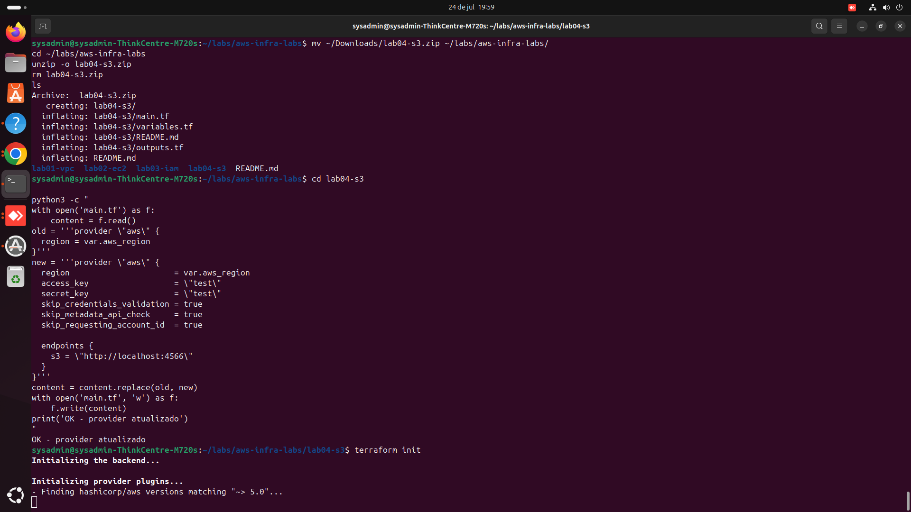
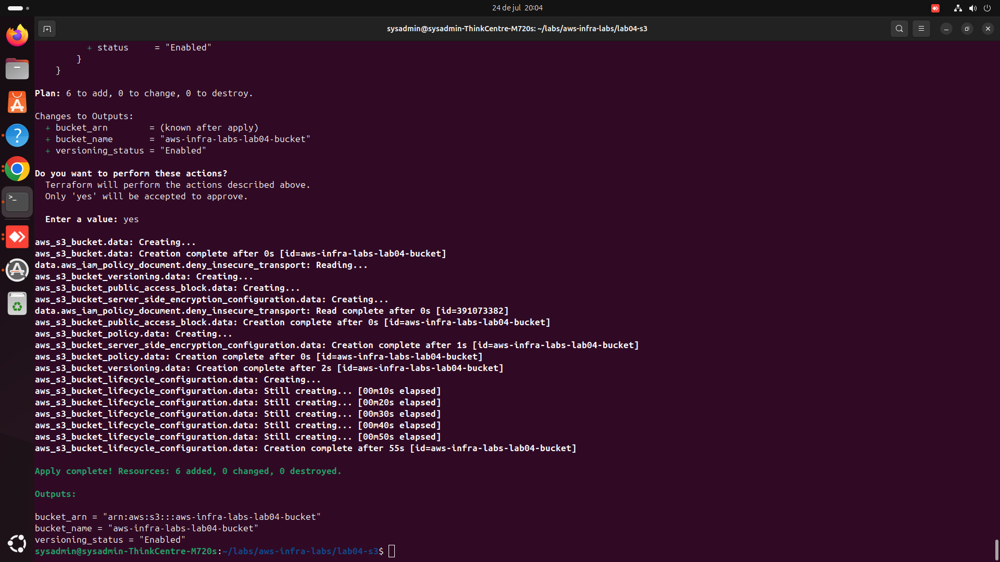

# Lab 04 — S3 com versionamento, criptografia e bucket policy segura

## Objetivo

Configurar um bucket S3 seguindo quatro camadas de proteção que, juntas, cobrem os erros mais comuns de configuração de storage na nuvem:

1. **Versionamento** — protege contra sobrescrita ou exclusão acidental de dados
2. **Bloqueio de acesso público** — impede que o bucket seja exposto publicamente por engano (a causa mais comum de vazamento de dados em S3)
3. **Criptografia em repouso (SSE)** — todo objeto é criptografado automaticamente, mesmo sem o uploader configurar nada
4. **Bucket policy que exige HTTPS** — nega qualquer requisição que não use `SecureTransport`, forçando criptografia em trânsito

## Por que isso importa

Buckets S3 públicos por engano são, historicamente, uma das causas mais comuns de vazamento de dados em incidentes de segurança na nuvem — geralmente por alguém que criou o bucket sem configurar o bloqueio de acesso público corretamente. Este lab aplica as proteções que deveriam ser padrão em qualquer bucket que armazene algo minimamente sensível.

## O que este lab cria

| Recurso | Proteção |
|---|---|
| `aws_s3_bucket` | O bucket em si |
| `aws_s3_bucket_versioning` | Mantém histórico de versões de cada objeto |
| `aws_s3_bucket_public_access_block` | Bloqueia ACLs e policies públicas, mesmo que alguém tente configurar isso depois |
| `aws_s3_bucket_server_side_encryption_configuration` | Criptografia AES-256 automática em todo objeto |
| `aws_s3_bucket_lifecycle_configuration` | Expira versões antigas após N dias (padrão: 90), evitando custo indefinido de armazenamento |
| `aws_s3_bucket_policy` | Nega qualquer acesso que não seja via HTTPS |

## Como rodar

```bash
terraform init
terraform plan
terraform apply
```

Para testar em LocalStack/ministack, adicione ao provider:

```hcl
provider "aws" {
  region                      = var.aws_region
  access_key                  = "test"
  secret_key                  = "test"
  skip_credentials_validation = true
  skip_metadata_api_check     = true
  skip_requesting_account_id  = true

  endpoints {
    s3 = "http://localhost:4566"
  }
}
```

## Validação

```bash
aws --endpoint-url=http://localhost:4566 s3api get-bucket-versioning --bucket aws-infra-labs-lab04-bucket
aws --endpoint-url=http://localhost:4566 s3api get-public-access-block --bucket aws-infra-labs-lab04-bucket
aws --endpoint-url=http://localhost:4566 s3api get-bucket-policy --bucket aws-infra-labs-lab04-bucket
```

## Limpeza

**Atenção**: como o bucket tem versionamento habilitado, se você subir algum objeto de teste, o `terraform destroy` pode falhar (buckets com versões de objetos não são removidos automaticamente). Para um bucket vazio (uso normal deste lab), basta:

```bash
terraform destroy
```

Se tiver testado uploads, esvazie o bucket antes (incluindo versões antigas) via console ou CLI antes do destroy.

## Próximos passos (lab05)

Lambda disparada por evento de upload no S3 — o primeiro lab de automação orientada a evento (event-driven), conectando este bucket a uma função serverless.

## Evidência de execução

**Setup do ambiente e `terraform init`:**



**`terraform apply` criando os 6 recursos (bucket, versionamento, criptografia, bloqueio público, lifecycle e policy):**


