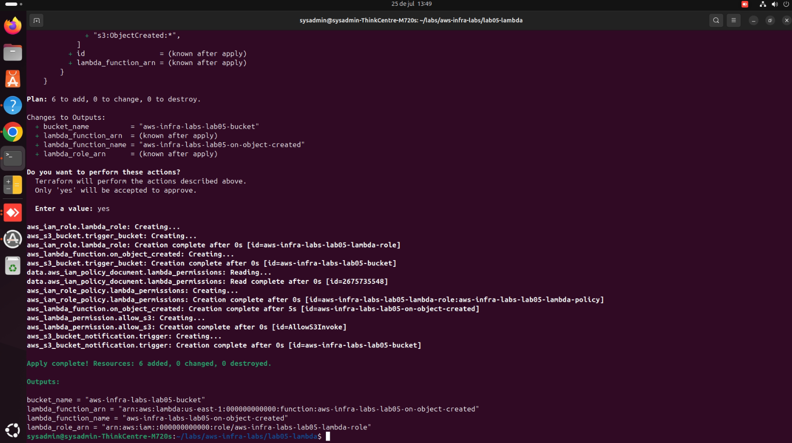
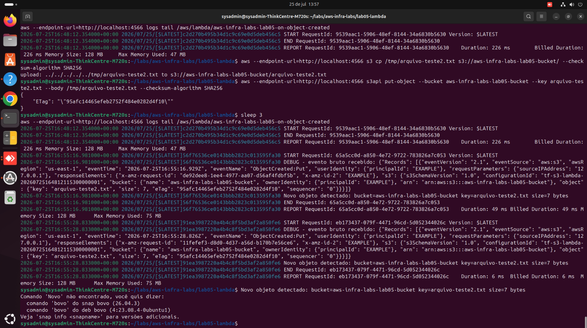

# Lab 05 — Lambda disparada por evento no S3

## Objetivo

O primeiro lab orientado a evento (*event-driven*) do projeto: uma função Lambda que é executada automaticamente toda vez que um objeto é criado em um bucket S3 — sem servidor, sem polling, sem cron job checando se algo mudou.

## Por que isso importa

Arquiteturas *event-driven* são a base de boa parte dos sistemas serverless modernos. Em vez de uma aplicação rodando 24/7 perguntando "tem algo novo?", o próprio evento (upload de um arquivo, por exemplo) dispara o processamento — o código só roda quando há trabalho de verdade a fazer, e você paga apenas por isso.

## Arquitetura

```
Upload de arquivo
      |
      v
[Bucket S3] --evento s3:ObjectCreated--> [Lambda Function] --logs--> [CloudWatch Logs]
```

## O que este lab cria

| Recurso | Papel |
|---|---|
| `aws_s3_bucket` | Bucket que recebe os uploads e dispara o evento |
| `data.archive_file` | Empacota o código Python em `.zip` automaticamente a cada `terraform apply` |
| `aws_iam_role` + trust policy | Só o serviço Lambda pode assumir esta role |
| `aws_iam_role_policy` | Least privilege: a Lambda só pode escrever logs e ler objetos deste bucket específico |
| `aws_lambda_function` | A função em si, runtime Python 3.12 |
| `aws_lambda_permission` | Autoriza especificamente o S3 (e nenhum outro serviço) a invocar esta Lambda |
| `aws_s3_bucket_notification` | Configura o bucket para chamar a Lambda a cada `ObjectCreated` |

## Sobre o `aws_lambda_permission`

Esse é um detalhe fácil de esquecer e que trava muita gente: mesmo com o `aws_s3_bucket_notification` configurado, o S3 **não tem permissão automática** para invocar uma Lambda. É preciso o `aws_lambda_permission` explícito autorizando `s3.amazonaws.com`, restrito ao `source_arn` deste bucket específico — outra camada de least privilege, dessa vez no sentido contrário (quem pode chamar a função).

## Como rodar

```bash
terraform init
terraform plan
terraform apply
```

Para testar em LocalStack/ministack, adicione ao provider (cobrindo os endpoints usados: `s3`, `iam`, `lambda`, `sts`, `logs`):

```hcl
provider "aws" {
  region                      = var.aws_region
  access_key                  = "test"
  secret_key                  = "test"
  skip_credentials_validation = true
  skip_metadata_api_check     = true
  skip_requesting_account_id  = true

  endpoints {
    s3     = "http://localhost:4566"
    iam    = "http://localhost:4566"
    lambda = "http://localhost:4566"
    sts    = "http://localhost:4566"
    logs   = "http://localhost:4566"
  }
}
```

## Testando o gatilho

Depois do `apply`, suba um arquivo de teste no bucket e veja se a Lambda dispara:

```bash
echo "teste" > /tmp/arquivo-teste.txt
aws --endpoint-url=http://localhost:4566 s3 cp /tmp/arquivo-teste.txt s3://aws-infra-labs-lab05-bucket/
```

Consulte os logs da execução:

```bash
aws --endpoint-url=http://localhost:4566 logs describe-log-groups
aws --endpoint-url=http://localhost:4566 logs tail /aws/lambda/aws-infra-labs-lab05-on-object-created
```

## Limpeza

```bash
terraform destroy
```

## Evolução futura

Este lab pode compor com o `lab04-s3` (bucket com versionamento/criptografia já configurado) em vez de criar um bucket próprio — outro exemplo de como módulos independentes podem ser combinados numa arquitetura real.

## Próximos passos

Com os 5 labs principais completos (VPC, EC2, IAM, S3 seguro e Lambda event-driven), este projeto já cobre os fundamentos de rede, computação, segurança e serverless na AWS.

## Evidência de execução

**`terraform apply` criando os 6 recursos (bucket, role, policy, Lambda, permissão e notificação):**



**Gatilho funcionando de ponta a ponta: upload no S3 dispara a Lambda, que recebe e processa o evento:**


